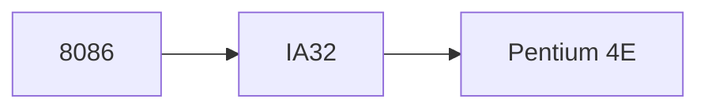

## 3.2 机器级编码

汇编程序员可见，但C程序员不可见的处理机状态：

- PC Promgram counter `%rip`
- 整数寄存器 integer register file
- 条件码寄存器 condition code registers
- 浮点数寄存器 set of floating-point registers

将C语言变成目标代码：

1.  **预处理器**会扩展源代码，插入所有用`#include`指令的文件，扩展所有用`#define`声明指定的宏。
2.  **编译器**基于编程语言的规则、目标机器的指令集和操作系统的惯例，会将源代码转换为汇编代码作为输出，给出程序的每一条指令。
3.  **汇编器**将汇编代码转化为二进制目标代码文件，它是机器代码的一种形式，包含了所有指令的二进制表示，但是还没有填入全局值的地址。
4.  **链接器**将目标代码文件和实现库函数的代码合并，产生最终可执行代码文件。

### 3.2.2 代码实例

```c
// mstore.c
long mult2(long, long);
void multstore(long x, long y,long *dest){
    long t = mult2(x,y);
    *dest = t;
} 
```

#### 编译器

```sh
gcc -Og -S mstore.c
```

-   `-Og`：是生成机器代码的优化等级，这个表示编译器会**生成符合原始C代码整体结构的机器代码**，这是用于调试的级别，便于我们学习观察。其他的`-O1`或`-O2`会得到更好的程序性能，但是机器代码和源代码的关系就比较难以理解。
-   `-S`：只生成到汇编代码。

```
multstore:
.LFB0:
	.cfi_startproc
	pushq	%rbx
	.cfi_def_cfa_offset 16
	.cfi_offset 3, -16
	movq	%rdx, %rbx
	call	mult2@PLT
	movq	%rax, (%rbx)
	popq	%rbx
	.cfi_def_cfa_offset 8
	ret
	.cfi_endproc
```

所有以`.`开头的行都是*指导汇编器和链接器工作的伪指令*，我们通常可以忽略这些行。对其化简并加上解释，可以得到汇编代码：

```
multstore:
	pushq	%rbx
	movq	%rdx, %rbx
	call	mult2@PLT
	movq	%rax, (%rbx)
	popq	%rbx
	ret
```

#### 汇编器和反汇编器

```sh
gcc -Og -c mstore.c
```

目标代码文件是二进制文件，无法直接查看，所以可以通过**反汇编器**(Disassembler)来将机器代码转化为类似汇编代码的格式

```sh
[lqb@ ~/Course/csapp/03/3.2.2CodeExample]$ objdump -d mstore.o

mstore.o：     文件格式 elf64-x86-64


Disassembly of section .text:

0000000000000000 <multstore>:
   0:   53                      push   %rbx
   1:   48 89 d3                mov    %rdx,%rbx
   4:   e8 00 00 00 00          callq  9 <multstore+0x9>
   9:   48 89 03                mov    %rax,(%rbx)
   c:   5b                      pop    %rbx
   d:   c3                      retq
```

1.  每个指令需要的**字节数不同**，常用的指令和需要较少操作数的指令所需的字节数比较少。
2.  每个指令都有自己对应的编码。
3.  反汇编得到的汇编代码和直接生成的有略微**差异**。

#### 链接器

```c
//main.c
void multstore(long, long, long*);

int main(){
    long d;
    multstore(2, 3, &d);
    printf("%d\n", d);
    return 0;
} 
long mult2(long a, long b){
    long s = a*b;
    return s;
}
```

```sh
gcc -Og -o prog main.c mstore.c
objdump -d prog
```

得到multistore函数部分

```sh
0000000000000741 <multstore>:
 741:   53                      push   %rbx
 742:   48 89 d3                mov    %rdx,%rbx
 745:   e8 ef ff ff ff          callq  739 <mult2>
 74a:   48 89 03                mov    %rax,(%rbx)
 74d:   5b                      pop    %rbx
 74e:   c3                      retq   
 74f:   90                      nop
```

可以发现和汇编器生成的**区别有**：

[08:18](https://www.bilibili.com/video/BV1Ci4y157P5/?spm_id_from=333.999.0.0&vd_source=196e9da8ee49a7879635d5a22229e6b3#t=498.0019)

1. 反汇编代码省略了很多指令的后缀 `q` 
2. 链接器将代码移到了**新的地址范围**内。
3.  第4行中，链接器**补充了调用函数`mult2`需要使用的地址**。
4.  多了两行`nop`，可以使得函数代码变成16字节，更好放置下一个代码。

### 3.2.3 总结

```sh
gcc -Og -S mstore.c #生成汇编代码
gcc -Og -c mstore.c #生成目标代码
objdump -d mstore.o #将目标代码转化为类汇编代码
gcc -Og -o prog main.c mstore.c #链接
```

## 3.3 数据格式

[06:04](https://www.bilibili.com/video/BV1Ci4y157P5/?spm_id_from=333.999.0.0&vd_source=196e9da8ee49a7879635d5a22229e6b3#t=364.426632)


## 3.4 访问信息

x86-64寄存器
[48:07](https://www.bilibili.com/video/BV1iW411d7hd?p=5&vd_source=196e9da8ee49a7879635d5a22229e6b3#t=2887.725651)
[03:39](https://www.bilibili.com/video/BV1Ci4y157P5/?spm_id_from=333.999.0.0&vd_source=196e9da8ee49a7879635d5a22229e6b3#t=219.106075)




- 有一个寄存器是 `%rsp` 只能用于作为栈(顶)指针
- 寄存器分为**调用者保存**寄存器和**被调用者保存**寄存器：
[04:05](https://www.bilibili.com/video/BV1Ci4y157P5/?spm_id_from=333.999.0.0&vd_source=196e9da8ee49a7879635d5a22229e6b3#t=245.073675)


### 3.4.1 指令的操作数

指令分为操作码和操作数：


操作数(ATT格式)：

[02:06](https://www.bilibili.com/video/BV1Lp4y167im/?spm_id_from=333.999.0.0&vd_source=196e9da8ee49a7879635d5a22229e6b3#t=126.228656)

1. 立即数 $\$x$
2. 寄存器 $r_a$
3. 内存引用 $()$

寻址模式：

[03:06](https://www.bilibili.com/video/BV1Lp4y167im/?spm_id_from=333.999.0.0&vd_source=196e9da8ee49a7879635d5a22229e6b3#t=186.23716)

$$Imm(r_b,r_i,s)$$
$$M=Imm+R[r_b]+R[r_i] s$$
- $Imm$ 立即数
- $r_b$ 基址寄存器
- $r_i$ 变址寄存器
- $s$ 比例因子必须为1,2,4,8 即**数组数据类型的大小**


```ad-caution
x86-64 是**64位**系统，内存引用使用的寄存器**必须是8字节寄存器**，不可能是 `(%eax)`这种情况
```

### 3.4.2 数据传送指令

#### 源操作数和目的操作数

[05:09](https://www.bilibili.com/video/BV1Lp4y167im/?spm_id_from=333.999.0.0&vd_source=196e9da8ee49a7879635d5a22229e6b3#t=309.075469)


```ad-info
title:通用情况
- 源操作数为立即数、寄存器、内存
- 目的操作数为寄存器、内存
```

```ad-caution
title:特殊情况
- 目的操作数和源操作数不能都是内存地址
- 如果要完成内存 `mov` 到内存需要两条 `mov` 指令[05:30](https://www.bilibili.com/video/BV1Lp4y167im/?spm_id_from=333.999.0.0&vd_source=196e9da8ee49a7879635d5a22229e6b3#t=330.091642)
```

#### 数据传送指令的大小


**源和目的的大小匹配**


[06:12](https://www.bilibili.com/video/BV1Lp4y167im/?spm_id_from=333.999.0.0&vd_source=196e9da8ee49a7879635d5a22229e6b3#t=372.706913)

```ad-info
title:一般情况
- 根据 `mov` 末尾的大小复制对应大小的数据
- `movq`源操作数是立即数时，只能用**32位补码**表示，然后进行**符号扩展**并传送到目的位置。
- 源操作数和目的操作数**大小必须匹配**
```

```ad-caution
title:特殊情况
- `movl` 以寄存器为目的时，会将寄存器的高位4字节置0。
- `movabsq`能够**以任意64位立即数**作为源操作数，并且**只能以寄存器作为目的**
```


**源和目的的大小不同**


[08:45](https://www.bilibili.com/video/BV1Lp4y167im/?spm_id_from=333.999.0.0&vd_source=196e9da8ee49a7879635d5a22229e6b3#t=525.552125)

```ad-info
title:一般情况
- `movs` 和 `movz` 类指令
- 将较**小**空间的数值传送到较**大**空间的位置上
- 然后分别进行**符号扩展和零扩展**
```

```ad-caution
title:特殊情况
- 没有 `movzlq` 这条指令，因为 `movq` 本身就会完成令扩展(高四字节置0)
- `cltq`没有操作数，等价于`movslq %eax,%rax`。
```

### 3.4.3 数据传送实例

[02:32](https://www.bilibili.com/video/BV1sV411b7c1/?spm_id_from=333.788&vd_source=196e9da8ee49a7879635d5a22229e6b3#t=152.762706)

```c
int main()
{
	long a = 4;
	long b = exchange(&a,3);
	printf("a = %ld,b = %ld\n",a,b);
	return 0;
}
```

```c
long exchange(long *xp, long y){
    long x = *xp;
    *xp = y;
    return x;
}
```

```text
 exchange:
    movq (%rdi),%rax
    movq %rsi,(%rdi)
    ret
```

- 根据惯例 `%rdi,%rsi` 分别用来存储**第1、2个**参数
- `%rax` 保存返回值

````ad-example
title:习题3.4

```c
src_t *sp;
dest_t *dp;
*dp = (dest_t) *sp;
```
`src_t` 和 `dest_t` 分别采用不同的类型

-   `long`--> `long`： x86-64限制不能在内存地址间传输，所以需要先经过一个寄存器，所以汇编指令为：`movq (%rdi), %rax`，`movq %rax, (%rsi)`。
-   `char`--> `int`：两个都是有符号数，而`char`时1个字节，`int`是4个字节，所以要先对数据进行有符号扩展，即`movsbl (%rdi), %eax`。然后将其转到对应的内存地址`movl %eax, (%rsi)`。
-   `char`--> `unsigned`：当大小和符号同时改变时，C中是先改变大小，再改变符号的。而`char`是有符号数，所以先对其进行有符号扩展`movsbl (%rdi), %eax`。由于有符号数和无符号数之间的位向量是相同的，所以直接将其保存到对应的内存地址就行，即`movl %eax, (%rsi)`。
-   `unsigned char`--> `long`：由于`long`是64位的，而且对`unsigned char`进行无符号扩展时是补充0，所以我们可以直接对低32位赋值，这样高4字节也会自动变成零，即`movzbl (%rdi),%eax`。然后将其整个转到对应的内存地址`movq %rax, (%rsi)`。
-   `int`--> `char`：因为`int`是32位的，而`char`是8位的，所以要直接对其进行截断。这里是先将其整个移到寄存器中，然后再将部分保存到内存中，即`movl (%rdi), %eax`，`movb %al, (%rsi)`。
-   `unsigned`--> `unsigned char`： 上同。
-   `char`--> `short`：`movbw (%rdi), %ax`，`movw %ax, (%rsi)`。

````

```ad-summary
title:类型转换总结
- 数据类型的范围**小-->大**，根据前面的类型判断使用符号扩展还是零扩展
- 数据类型的范围**大-->小**，直接根据小类型选择 `mov` 指令
```

### 3.4.4 push 和 pop

按照惯例
- 栈底在上，栈顶在下
- 上方为高地址，下方为低地址
- 压栈时栈指针做**减**法


[05:30](https://www.bilibili.com/video/BV1sV411b7c1/?spm_id_from=333.788&vd_source=196e9da8ee49a7879635d5a22229e6b3#t=330.909851)

压栈：先减栈指针，再写入数据
弹栈：先读取数据，再加栈指针

## 3.5 算数和逻辑运算

### 3.5.1 加载有效地址

[00:16](https://www.bilibili.com/video/BV1n54y1x7L8/?spm_id_from=333.788&vd_source=196e9da8ee49a7879635d5a22229e6b3#t=16.932523)

`leaq Src, Dst`

- `Src` 是内存引用的形式，但**实质上没有引用内存的数据**，而是将表示的**有效地址写入** `Dst`
- 实际上，编译器有一些 `leaq` 的灵活用法，使用起来**根本与有效地址计算无关**
- 要求**目的操作数必须是寄存器**

````ad-example
title:leaq用于实现快速乘法运算的灵活用法
```c
long m12(long x)
{
    return x * 12;
}
```
可以只用leaq指令完成快速运算
```text
leaq (%rdi, %rdi, 2), %rax # t <- x+x*2
salq $2, %rax              # return t << 2
```
````

### 3.5.2 一元操作和二元操作


[03:42](https://www.bilibili.com/video/BV1n54y1x7L8/?spm_id_from=333.788&vd_source=196e9da8ee49a7879635d5a22229e6b3#t=222.909439)

```ad-example
title:习题3.5


不同指令的运算结果：

```

```ad-example
title:习题3.11
- xorq %rdx,%rdx 可以**实现将%rdx置0**的功能
- 相比于movq $0,%rdx **编码字节长度更短**
- 
```

### 3.5.3 移位操作

[05:37](https://www.bilibili.com/video/BV1n54y1x7L8/?spm_id_from=333.788&vd_source=196e9da8ee49a7879635d5a22229e6b3#t=337.075715)


- k可以是**立即数或寄存器**，寄存器**必须使用%cl**
- 使用 `%cl` 对$w$位长的数据进行移位操作，移位量实际上是由 `%cl` 的**低 $log_2w$决定的** [06:02](https://www.bilibili.com/video/BV1n54y1x7L8/?spm_id_from=333.788&vd_source=196e9da8ee49a7879635d5a22229e6b3#t=362.586278)

### 3.54 算数运算实例

[06:42](https://www.bilibili.com/video/BV1n54y1x7L8/?spm_id_from=333.788&vd_source=196e9da8ee49a7879635d5a22229e6b3#t=402.600294)

```c
long arith(long x,long y,long z)  
{  
	long t1 = x^y;  
	long t2 = z*48;  
	long t3 = t1 & 0x0F0F0F0F;  
	long t4 = t2 - t3;  
	return t4;  
}
```

```text
xorq	%rsi, %rdi
leaq	(%rdx,%rdx,2), %rax
salq	$4, %rax
andl	$252645135, %edi
subq	%rdi, %rax
ret
```

注意 `long t2 = z*48` 被拆分成两条指令 `leaq (%rdx,%rdx,2), %rax  salq $4, %rax` ,相当于乘3再乘16。**不直接使用乘法指令是因为乘法指令的执行需要更多的时间**

### 3.5.5 特殊的算数操作


`imulq` 和 `mulq` 
- 两条指令只有一个操作数，但是**隐含寄存器为%rax**
- 乘积的结果为 128 位，分别**保存在寄存器 %rdx(高64位) 和 %rax(低64位)**

````ad-example
```c
void store_uprod(unint128_t *dest,unint_64 x,unint_64 y)
{
	*dest = x*(unint128_t)y;
}
```
```text
movq %rsi,%rax
mulq %rdx
movq %rax,(%rdi)
movq %rdx,8(%rdi)
```
- `mulq %rdx` 实际将 %rdx 和 %rax相乘
- 计算机采用小端法，将低64位存储在(%rdi) 高64位存储在8(%rdi)
````

`idivq` 和 `divq`
- 实现128位除法时，**%rdx %rax分别存储被除数的高64位和低64位**，除数由操作数给出，运算结果，**%rax存储商，%rdx存储余数**
- 对64位除法应用，**%rax存储被除数**，同时要 **保证%rdx为0(无符号除法)或%rax的符号位(有符号除法)**，这个过程是可以直接用指令 `cqto` 完成


## 3.6 控制

### 3.6.1 条件码

#### 条件码寄存器

[01:04](https://www.bilibili.com/video/BV1Jf4y1y7Nd/?spm_id_from=333.788&vd_source=196e9da8ee49a7879635d5a22229e6b3#t=64.605996)


-   ZF：零标志，最近的操作得到的结果是否为0。
-   无符号数：
	-   CF：进位标志，最近的操作使得**最高位产生进位**。可用来检查无符号数是否存在溢出。
-   补码：
	-   SF：符号标志，最近的操作得到的结果为负数。
	-   OF：溢出标志，最近的操作导致**补码溢出**（可以通过符号位进一步判断是正溢出还是负溢出）

#### 算数运算和条件码


当执行上图的算数运算指令时，会修改条件寄存器

```ad-warning
leaq不会修改条件码
```

#### CMP和TEST

[03:15](https://www.bilibili.com/video/BV1Jf4y1y7Nd/?spm_id_from=333.788&vd_source=196e9da8ee49a7879635d5a22229e6b3#t=195.542141)

- CMP和TEST两类指令类似都是**只设置条件码寄存器而不改变其他寄存器**
- **CMP和SUB**指令的行为一致
- **TEST和AND**指令行为一致
	- `test %rax,%rax` 检查 %rax 是正数、负数还是0

### 3.6.2 访问条件码

[07:30](https://www.bilibili.com/video/BV1Jf4y1y7Nd/?spm_id_from=333.788&vd_source=196e9da8ee49a7879635d5a22229e6b3#t=450.540102)


有符号数一般判断*零标志位、溢出标志位和符号标志位*：


无符号数一般判断*零标志位和进位位*：


### 3.6.3 跳转指令

```ad-info
title:跳转指令分为两类
- 直接跳转：在汇编中以**标号**表示跳转目标 `jmp .L1`
- 间接跳转：**\*** 后给出操作数表示跳转目标
	- `jmp *%rax` 寄存器的值为跳转目标
	- `jmp *(%rax)` 内存引用为跳转目标
```


```ad-caution
条件跳转只能是直接跳转
```

### 3.6.4 跳转指令编码

```ad-info
title: 目标地址的编码分为两类
- 相对寻址：最常用
	- 目的地址-跳转指令的下一条指令的地址
	- 长度可以是**1、2、4**字节
- 绝对寻址
	- 4字节直接标明目的地址
```

````ad-example
title: 相对寻址的例子

将汇编产生的目标代码文件和链接后的程序**反汇编**给结果为：

---
```ad-info
title:汇编的目标代码文件
- 第2行的跳转指令目的地址为：0x03(相对地址，由指令的第2个字节给出)+0x05(下一条指令的地址) = 0x08
- 第5行的跳转指令目的地址为：0xf8+0x0d = 0x05
```
---
```ad-info
title:链接后的可执行文件
可以发现，第2行和第5行跳转指令中相对地址没有发生改变
```
````

### 3.6.5 条件控制实例

[00:14](https://www.bilibili.com/video/BV1Xr4y1T7T1/?spm_id_from=333.788&vd_source=196e9da8ee49a7879635d5a22229e6b3#t=14.7002)

````ad-example
```c
long absdiff(long x, long y)
{
    long result;
    if (x > y)
        result = x-y;
    else
        result = y-x;
    return result;
}
```

对应汇编代码(未优化)为：

```c
absdiff:
    cmpq    %rsi, %rdi
    jle     .L4
    movq    %rdi, %rax
    subq    %rsi, %rax
    ret
.L4:    # x <= y
    movq    %rsi, %rax
    subq    %rdi, %rax
    ret
```

如果将汇编代码改写成C语言代码为：

```c
long absdiff_goto(long x, long y)
{
    long result;
    int ntest = x <= y;
    if (ntest) goto Else;
    result = x-y;
    return result;
Else:
    result = y-x;
    return result;
}
```
````

也就是说对应 `if-else` 的C语言代码，汇编实现会以以下形式实现：

```c
	t = test-expr;
	if(!t)
		goto false;
	then-statement
	goto done:
else:
	else-statment
done:
```

````ad-info
if语句翻译成goto有另一种实现：
```c
	t = test-expr;
	if(t)
		goto true;
	else-statement
	goto done:
true:
	then-statment
done:
```
但是原来的方法更好，因为他对通常情况下**有if但没有else**的支持更好
```c
	t = test-expr;
	if(!t)
		goto done;
	then-statement
	goto done:
done:
```
````

### 3.6.6 条件传送

[01:40](https://www.bilibili.com/video/BV1Xr4y1T7T1/?spm_id_from=333.788&vd_source=196e9da8ee49a7879635d5a22229e6b3#t=100.498859)


```c
long absdiff(long x, long y){
  if(x<y)
    return y-x;
  else:
    return x-y;
}
```

编译后：

```text
absdiff:
  movq %rsi, %rax
  subq %rdi, %rax  //y-x
  movq %rdi, %rdx
  subq %rsi, %rdx  //x-y
  cmpq %rsi, %rdi
  cmovge %rdx, %rax
  ret 
```

改写成C代码为：

```c
long cmovdiff(long x, long y){
	long rval = y-x;
	long lval = x-y;
	long ntest = x>=y;
	if(ntest) rval = lval;
	return rval;
}
```

- 可以发现，编译器既计算了y-x也计算了x-y
- 使用条件传送方式的汇编代码效率更高，这是因为现代处理器通过流水线方式获得高性能，而**条件分支**方式需要采用**分支预测**判断跳转是否执行，如果预测失败会导致程序性能严重下降[02:04](https://www.bilibili.com/video/BV1Xr4y1T7T1/?spm_id_from=333.788&vd_source=196e9da8ee49a7879635d5a22229e6b3#t=124.347541)
- 但是不是所有 `if` 语句都能用条件传送来编译

### 3.6.7 循环

[03:30](https://www.bilibili.com/video/BV1Xr4y1T7T1/?spm_id_from=333.788&vd_source=196e9da8ee49a7879635d5a22229e6b3#t=210.982809)

#### do while

```c
// Do While 的 C 语言代码
long pcount_do(unsigned long x)
{
    long result = 0;
    do {
        result += x & 0x1;
        x >>= 1;
    } while (x);
    return result;
}

// Goto 版本
long pcount_goto(unsigned long x)
{
    long result = 0;
loop:
    result += x & 0x1;
    x >>= 1;
    if (x) goto loop;
    return result;
}
```

#### while

```c
// C While version
while (Test)
	Body

// Goto Jump to middle Version
	goto test;
loop:
	Body
test:
	if (Test)
		goto loop;
done:

// Goto graded-do Version
if(!Test)
	goto done;
Loop:
	body-statement
	if(Test) goto loop;
done:
```

#### for

```c
// For
for (Init; Test; Update)
	Body
	
// While Version
Init;
while (Test) {
	Body
	Update;
}
```

- `for` 循环实际上可以看成 `init-expr` + `for` 循环 的过程

### 3.6.8 switch

[05:20](https://www.bilibili.com/video/BV1Xr4y1T7T1/?spm_id_from=333.788&vd_source=196e9da8ee49a7879635d5a22229e6b3#t=320.725252)

- `switch`语句可以根据一个整数索引数值进行多重分支。通常使用**跳转表**（Jump Table）数据结构使得实现更加高效，它是一个数组，每个元素是对应的代码块起始地址，根据整数索引得到对应的代码地址后，就可以直接跳转到对应的代码块。
- 相比很长的`if-else`语句的优势在于：执行`switch`语句的时间**与分支数目无关**。比如有很长的分支语句，如果用`if-else`实现，则可能需要经过若干个`if-else`才能跳转到目的代码块，而使用`switch`能根据跳转表直接获得代码块地址
- GCC 根据 `swith` 的情况来翻译：当**数量多**并且**值的跨度小**时，就会使用跳转表

```c
long switch_eg (long x, long y, long z){
	long w = 1;
	switch (x) {
		case 1:
			w = y*z;
			break;
		case 2:
			w = y/z;
			// fall through
		case 3:
			w += z;
			break;
		case 5:
		case 6:
			w -= z;
			break;
		default:
			w = 2;
	}
	return w;
}
```

```text
switch_eg:
    movq    %rdx, %rcx
    cmpq    $6, %rdi    # x:6
    ja      .L8
    jmp     *.L4(, %rdi, 8)

#跳转表
.section    .rodata
    .align 8
.L4:
    .quad   .L8 # x = 0
    .quad   .L3 # x = 1
    .quad   .L5 # x = 2
    .quad   .L9 # x = 3
    .quad   .L8 # x = 4
    .quad   .L7 # x = 5
    .quad   .L7 # x = 6
```

```ad-note
- case的范围是1~6
- 汇编代码**先判断是否超过6**，如果超过则执行defalut
- 没超过6**再根据跳转表进行跳转**
```

## 3.7 过程

在过程调用中主要涉及三个重要的方面：

1.  传递控制：包括如何开始执行过程代码，以及如何返回到开始的地方
2.  传递数据：包括过程需要的参数以及过程的返回值
3.  内存管理：如何在过程执行的时候分配内存，以及在返回之后释放内存

### 3.7.1 运行时的栈

[01:12](https://www.bilibili.com/video/BV19X4y1P7Pn/?spm_id_from=333.788&vd_source=196e9da8ee49a7879635d5a22229e6b3#t=72.627754)


- 当过程需要的存储空间*超过寄存器所能存放的大小时*，就会在栈上分配空间，这个空间被称为过程的**栈帧**
- 大部分的栈帧在过程开始时就分配好了
- 通过寄存器最多可以传递6个参数，**更多的参数需要通过过程传递**
- 许多函数其实不需要栈帧，所有局部变量都能存储到寄存器中，也不需要调用其他函数

栈帧的通用组成：


- 被保存的寄存器(被调用者保存寄存器在函数调用前的值)
- 局部变量
- 参数构造区(调用的函数传递参数)
- 栈顶的返回地址

### 3.7.2 转移控制

[02:03](https://www.bilibili.com/video/BV19X4y1P7Pn/?spm_id_from=333.788&vd_source=196e9da8ee49a7879635d5a22229e6b3#t=123.122007)


- call
	- 和跳转一样，可以是直接调用或间接调用
	- 1. 将下一条指令的地址压栈
	- 2. 将跳转的目的地址写入 PC
- ret
	- 将栈中存储的地址弹出到 PC

```c
// main.c
#include <stdio.h>
void multstore(long, long, long*);

int main(){
    long d;
    multstore(2, 3, &d);
    printf("2*3-->%ld\n", d);
    return 0;
} 
long mult2(long a, long b){
    long s = a*b;
    return s;
}
// mstore.c
long mult2(long, long);
void multstore(long x, long y,long *dest){
    long t = mult2(x,y);
    *dest = t;
} 
```

```sh
gcc -Og -o prog mstore.c main.c
objdump -d prog> prog.s
```

节选部分结果：

```text
0000000000001169 <multstore>:
    1169:	f3 0f 1e fa          	endbr64 
    116d:	53                   	push   %rbx
    116e:	48 89 d3             	mov    %rdx,%rbx
    1171:	e8 68 00 00 00       	call   11de <mult2>
    1176:	48 89 03             	mov    %rax,(%rbx)
    1179:	5b                   	pop    %rbx
    117a:	c3                   	ret    

000000000000117b <main>:
    117b:	f3 0f 1e fa          	endbr64 
    117f:	48 83 ec 18          	sub    $0x18,%rsp
    1183:	64 48 8b 04 25 28 00 	mov    %fs:0x28,%rax
    118a:	00 00 
    118c:	48 89 44 24 08       	mov    %rax,0x8(%rsp)
    1191:	31 c0                	xor    %eax,%eax
    1193:	48 89 e2             	mov    %rsp,%rdx
    1196:	be 03 00 00 00       	mov    $0x3,%esi
    119b:	bf 02 00 00 00       	mov    $0x2,%edi
    11a0:	e8 c4 ff ff ff       	call   1169 <multstore>
    11a5:	48 8b 14 24          	mov    (%rsp),%rdx
    11a9:	48 8d 35 54 0e 00 00 	lea    0xe54(%rip),%rsi        # 2004 <_IO_stdin_used+0x4>
    11b0:	bf 01 00 00 00       	mov    $0x1,%edi
    11b5:	b8 00 00 00 00       	mov    $0x0,%eax
    11ba:	e8 b1 fe ff ff       	call   1070 <__printf_chk@plt>
    11bf:	48 8b 44 24 08       	mov    0x8(%rsp),%rax
    11c4:	64 48 2b 04 25 28 00 	sub    %fs:0x28,%rax
    11cb:	00 00 
    11cd:	75 0a                	jne    11d9 <main+0x5e>
    11cf:	b8 00 00 00 00       	mov    $0x0,%eax
    11d4:	48 83 c4 18          	add    $0x18,%rsp
    11d8:	c3                   	ret    
    11d9:	e8 82 fe ff ff       	call   1060 <__stack_chk_fail@plt>
    
00000000000011de <mult2>:
    11de:	f3 0f 1e fa          	endbr64 
    11e2:	48 89 f8             	mov    %rdi,%rax
    11e5:	48 0f af c6          	imul   %rsi,%rax
    11e9:	c3                   	ret
```

- 11a0 地址处的call指令将地址 11a5 压入栈中 然后跳转到multisore 的第一条指令

### 3.7.3 数据传送

[03:25](https://www.bilibili.com/video/BV19X4y1P7Pn/?spm_id_from=333.788&vd_source=196e9da8ee49a7879635d5a22229e6b3#t=205.905129)


- 超过6个的参数需要保存在栈中
- 通过栈传递的参数必须**向8的倍数对齐**，而**局部变量不需要对齐**
- 由调用者将对应的参数传送到对应的寄存器中

### 3.7.4 栈上的局部存储

[04:39](https://www.bilibili.com/video/BV19X4y1P7Pn/?spm_id_from=333.788&vd_source=196e9da8ee49a7879635d5a22229e6b3#t=279.87774)

有些时候局部变量不能存放到寄存器中，必须放在栈上：

- 寄存器不足以存放所有局部变量
- **对局部变量使用了 `&`** ，因此必须为其产生一个地址
- 局部变量是**数组或结构**

[05:41](https://www.bilibili.com/video/BV19X4y1P7Pn/?spm_id_from=333.788&vd_source=196e9da8ee49a7879635d5a22229e6b3#t=341.512164)

````ad-example

- 函数 `call_proc()` 内的局部变量都有&操作，因此要存放在栈帧上
- x1,x2,x3,x4 分别占用 8，4，2，1 字节的空间，依序存放在栈帧上，不需要对齐8的倍数
- 调用 `proc` 需要8个参数，因此第7、第8个参数放在栈帧上，需要对齐8的倍数
````

### 3.7.5 寄存器的局部存储空间

[06:29](https://www.bilibili.com/video/BV19X4y1P7Pn/?spm_id_from=333.788&vd_source=196e9da8ee49a7879635d5a22229e6b3#t=389.122182)


- 除了 %rsp 其他的寄存器都分为**调用者保存和被调用者保存**
- 传递参数的那6个寄存器都是被调用者保存
- 栈基指针寄存器是调用者保存

```ad-note
title:调用者保存和被调用者保存
假设P调用Q
- 被调用者保存寄存器：
	- 情况1：Q**根本不改变寄存器的值**；
	- 情况2：Q要先将寄存器压栈，修改寄存器的值，在返回前弹出旧值
- 调用者保存寄存器：
	- P在调用Q将寄存器值压栈
	- 在P内**所有调用完成后**，将寄存器的值弹出
```

````ad-example

- %rbx 和 %rbp 是调用者保存寄存器，所以P在调用Q前需要先将两个数据压栈保存，并在两次调用Q都结束后再将数据弹栈恢复
- 调用 `Q(y)` 时，将y保存在%rdi 以便Q将其作为第一个参数
````

### 3.7.6 递归过程

[07:40](https://www.bilibili.com/video/BV19X4y1P7Pn/?spm_id_from=333.788&vd_source=196e9da8ee49a7879635d5a22229e6b3#t=460.849342)

````ad-example

- 用 %rbx 保存当前递归的n
- 先要将 %rbx(上一次递归的n) 压栈，再将 %rdi(本次递归的n) 传送到 %rbx
````

### 3.7.7 总结

```ad-summary
栈帧通常包括：
- 被保存的寄存器
	- 在栈帧上保存的这部分数据都是
- 局部变量
- 参数构造区
- 栈顶的返回地址
```

## 3.8 数组分配和访问

### 3.8.1 地址运算

[00:04](https://www.bilibili.com/video/BV1ho4y1d7J6/?spm_id_from=333.788&vd_source=196e9da8ee49a7879635d5a22229e6b3#t=4.694508)

`int A[];`

`A[i]` 的内存引用为 `(%rdx,%rcx,4)` %rdx 为数组的地址，%rcx 存储i

### 3.8.2 指针运算

[00:44](https://www.bilibili.com/video/BV1ho4y1d7J6/?spm_id_from=333.788&vd_source=196e9da8ee49a7879635d5a22229e6b3#t=44.157611)

C语言指针运算会**根据引用的数据类型的大小进行伸缩**

````ad-example

用 `leaq` 计算地址
- &E[2] `leaq 8(%rdx),%rax;`
- E+i-1 `leaq -4(%rdx,%rcx,4),%rax`

用 `movl` 计算数组元素
- E[i] `movl (%rdx,%rcx,4),%rax`
````

### 3.8.3 嵌套数组

[04:13](https://www.bilibili.com/video/BV1ho4y1d7J6/?spm_id_from=333.788&vd_source=196e9da8ee49a7879635d5a22229e6b3#t=253.314194)

`T D[R][C]`

`&D[i][j] = D + L(i*C+j)`


### 3.8.4 定长数组

[05:05](https://www.bilibili.com/video/BV1ho4y1d7J6/?spm_id_from=333.788&vd_source=196e9da8ee49a7879635d5a22229e6b3#t=305.354241)

### 3.8.5 变长数组

[08:06](https://www.bilibili.com/video/BV1ho4y1d7J6/?spm_id_from=333.788&vd_source=196e9da8ee49a7879635d5a22229e6b3#t=486.509943)

## 3.9 复合数据结构

### 3.9.1 结构体

[00:14](https://www.bilibili.com/video/BV1754y1Y7Ut/?spm_id_from=333.788&vd_source=196e9da8ee49a7879635d5a22229e6b3#t=14.175409)

````ad-example
title:访问结构体成员的方式
```c
struct rec
{
	int i;
	int j;
	int a[2];
	int *p;
}
struct rec r;
```
假设 r 的地址存放在 %rdi 中
- i 的地址引用为 `(%rdi)`
- j 为 `4(%rdi)`
- a 为 `8(%rdi)`
````

### 3.9.2 联合体

[05:20](https://www.bilibili.com/video/BV1754y1Y7Ut/?spm_id_from=333.788&vd_source=196e9da8ee49a7879635d5a22229e6b3#t=320.552999)

### 3.9.3 数据对齐

[01:40](https://www.bilibili.com/video/BV1754y1Y7Ut/?spm_id_from=333.788&vd_source=196e9da8ee49a7879635d5a22229e6b3#t=100.471316)

**任何K字节的基本类型必须对齐K的整数倍**


结构体的**末尾**也需要填充到对齐8字节

## 3.10 结合控制和数据

### 3.10.1 理解指针

### 3.10.2 GDB

### 3.10.3 缓冲区溢出

C语言对于数组引用不经过任何边界检查，所以如果对越界的数组进行写操作会导致在栈上存储的局部变量或状态信息被破坏。

[00:31](https://www.bilibili.com/video/BV1Ry4y1h7bm/?spm_id_from=333.788&vd_source=196e9da8ee49a7879635d5a22229e6b3#t=31.602987)

````ad-example
```c
void echo()
{
	char buf[8];
	gets(buf);
	puts(buf);
}
```


可以看到其实如果读取的字符串没有超过24都没有严重的后果，但是如果超过了就会破坏返回地址甚至是caller保存的状态
````

### 3.10.4 对抗缓冲区溢出

#### 栈随机化

[02:17](https://www.bilibili.com/video/BV1Ry4y1h7bm/?spm_id_from=333.788&vd_source=196e9da8ee49a7879635d5a22229e6b3#t=137.894689)

- 让程序在程序每次运行时都有变化
- 在linux中栈随机化已经变成标准行为 ASLR

#### 栈破坏检测

[03:42](https://www.bilibili.com/video/BV1Ry4y1h7bm/?spm_id_from=333.788&vd_source=196e9da8ee49a7879635d5a22229e6b3#t=222.343046)


- 在**局部缓冲区**和**栈状态**间存储**金丝雀值**
- 金丝雀值是随机产生的，存储在**段上的一个只读区域**
- 函数运行开始将金丝雀值存储在栈上的对应位置，函数运行将要结束时，通过 `xorq` **比较栈上的金丝雀值和段上只读区域的金丝雀值**，如果两者不等，则会调用一个错误例程

#### 限制可执行代码区域

[05:14](https://www.bilibili.com/video/BV1Ry4y1h7bm/?spm_id_from=333.788&vd_source=196e9da8ee49a7879635d5a22229e6b3#t=314.174179)

通过内存保护消除攻击者向系统插入代码的能力

### 3.10.5 变长栈帧

- 当函数调用 `alloca` 函数时，需要在栈上分配任意字节的空间，编译器就需要支持变长栈帧
- 为了管理变长栈帧，需要**使用寄存器** `%rbp` ，它是一个被调用者保存寄存器

变长栈帧的函数过程：
1. 将 `%rbp` 压栈保存 `pushq %rbp`
2. 将 `%rbp` 设置为当前栈顶地址 `movq %rsp,%rbp`
3. 函数主体
4. **在函数结尾 `ret` 前执行 `leave` 指令**等价于 `movq %rbp,%rsp` `popq %rbp`

```ad-caution
在较早的版本函数调用都会使用 `%rbp` ，但是现在**只有在栈帧变长的情况下采用使用**
```

## 3.11 浮点代码

## 3.12 程序优化

### 代码移动

如果一个表达式总是得到同样的结果，最好把它**移动到循环外面**，这样只需要计算一次。编译器有时候可以自动完成，比如说使用 `-O1` 优化

### 减少计算强度

用移位操作替代部分乘法

### 公共子表达式

重用表达式的计算结果

### 过程调用

`for(int i=0;i<strlen(s);i++)`

改为

`int len = strlen(s);for(int i=0;i<len;i++)`

### 内存问题

```c
// 把 nxn 的矩阵 a 的每一行加起来，存到向量 b 中
void sum_rows1(double *a, double *b, long n)
{
    long i, j;
    for (i = 0; i < n; i++)
    {
        b[i] = 0;
        for (j = 0; j < n; j++)
            b[i] += a[i*n + j];
    }
}
```

在汇编中，每次都会把 `b[i]` 存进去再读出来

```c
// 把 nxn 的矩阵 a 的每一行加起来，存到向量 b 中
void sum_rows2(double *a, double *b, long n)
{
    long i, j;
    for (i = 0; i < n; i++)
    {
        double val = 0;
        for (j = 0; j < n; j++)
            val += a[i*n + j];
        b[i] = val;
    }
}
```

加入临时变量后就没有此行为

### 条件分支

如果处理器不停判断错误的话（比方说代码逻辑写得很奇怪），性能就会得到极大的拖累